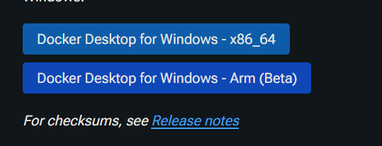

# Docker安裝教學

## 下載Docker Desktoiop from Windows
- [docker官網安裝網址](https://docs.docker.com/desktop/setup/install/windows-install/)



如果你的電腦是一般的 Windows 11 x86_64 (也就是大部分 Intel 或 AMD CPU) 環境，那麼建議安裝 Docker Desktop for Windows - x86_64 版本，因為它是成熟的正式版，相容性和穩定度較佳。

只有在你的 Windows 11 環境是基於 ARM 架構的處理器 (如搭載 Snapdragon 或其他 ARM CPU 的 Windows 裝置)，而且你有明確需求去在該平台上執行 Docker，再考慮安裝 Docker Desktop for Windows - Arm (Beta)。該版本目前仍屬測試性質，可能在功能與穩定性上不如 x86_64 正式版可靠。

總結來說，若你使用的是一般 Windows 11 PC(絕大多數是 x86_64)，請選擇 x86_64 版本的 Docker Desktop。


## 步驟一：啟動 Docker Desktop
1. 啟動 Docker Desktop：
    - 從「開始」選單搜尋並點擊 Docker Desktop，等待 Docker Desktop 啟動並確認右下角的 Docker 圖示顯示為「已啟動 (Running)」狀態。


# 常用指令

Use the following command to list all containers, including stopped ones:
```bash
docker ps -a
```

If the container is no longer needed, remove it:
```bash
docker rm mymysql
```

If the container is currently running, you will need to stop it first:

（注意：移除容器會連同該容器的資料一起刪除，請先備份重要資料）
```bash
docker stop mymysql
docker rm mymysql
```

Run the New Container
- -name mymysql：將容器命名為 mymysql
- -e MYSQL_ROOT_PASSWORD=my-secret-pw：設定 MySQL root 帳號的密碼 (請自行修改為安全密碼)
- -p 3306:3306：將主機(Windows)的 3306 埠對應至容器內的 3306 埠，以便從本機或其他工具連線 MySQL。
- -d：以背景執行容器。
```bash
docker run --name mymysql -e MYSQL_ROOT_PASSWORD=my-secert-pw -p 3306:3306 -d mysql:latest
```

If you don’t want to remove the existing container, run the new one with a different name:
```bash
docker run --name mymysql2 -e MYSQL_ROOT_PASSWORD=my-secert-pw -p 3307:3306 -d mysql:latest
```

停止容器
```bash
docker stop mymysql
```

再次啟動容器
```bash
docker start mymysql
```

透過 Docker Exec 進入容器內部的 MySQL 客戶端
```bash
docker exec -it mymysql mysql -uroot -p
```